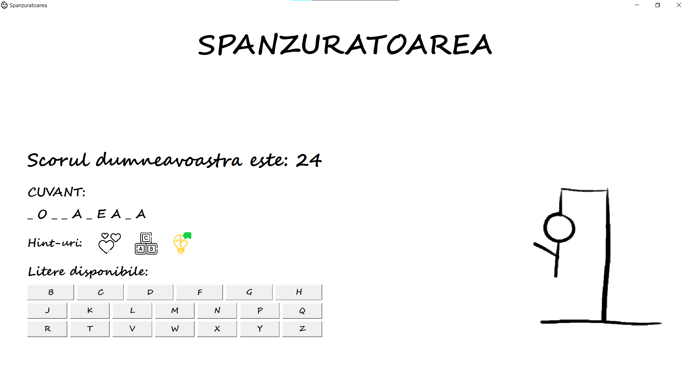
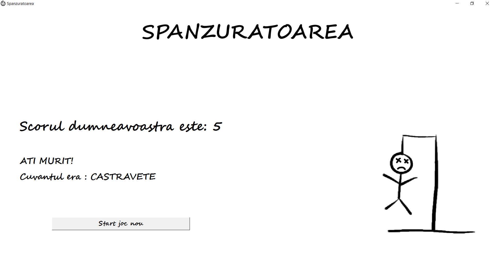

# Cpp-Project-OOP---The-hangman
I tried to create a game that I used to play when I was in high school with my classmates. The game is called The Hangman and was made in a few hours. It's not very complicated, but I like how it turned out.

Game home page:

Guess the word by choosing the right letters and using the hints:

If you didn't guess the word you will lose, but you can play again:

